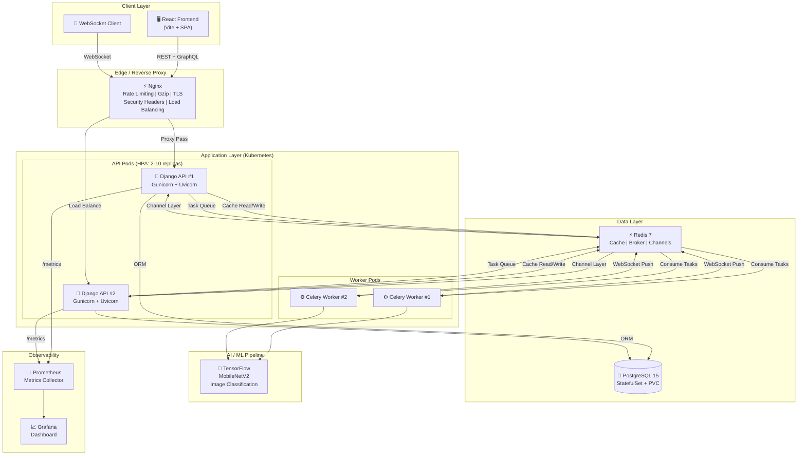
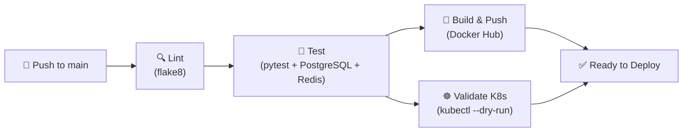

# 🐦 Twitter Clone — Production-Grade Microservices Architecture

<div align="center">

**A full-stack social media platform built with production-grade infrastructure, containerized microservices, and cloud-native deployment patterns.**


</div>

---

## 🏗️ System Architecture



---

## 🧰 Technology Stack

| Layer | Technology | Purpose |
|---|---|---|
| **Frontend** | React 18, Vite | Single Page Application |
| **API** | Django REST Framework | RESTful CRUD endpoints |
| **API (Alt)** | Strawberry GraphQL | Flexible query interface |
| **Auth** | Token Authentication | Stateless API auth + Rate Limiting |
| **Real-time** | Django Channels + WebSockets | Live notifications (AI results, comments) |
| **Task Queue** | Celery + Redis Broker | Async background processing |
| **AI/ML** | TensorFlow (MobileNetV2) | Image classification & auto-tagging |
| **Database** | PostgreSQL 15 | Primary data store (StatefulSet in K8s) |
| **Cache** | Redis 7 (django-redis) | Feed caching with TTL + invalidation |
| **Reverse Proxy** | Nginx | Rate limiting, gzip, TLS, load balancing |
| **Containers** | Docker (Multi-stage) | Production-optimized builds |
| **Orchestration** | Kubernetes | Auto-scaling, rolling deploys, self-healing |
| **Monitoring** | Prometheus + Grafana | Metrics collection & dashboard |
| **CI/CD** | GitHub Actions | Lint → Test → Build → Validate pipeline |
| **Testing** | Pytest | Automated API tests |

---

## 🔑 Key System Design Features

### 1. Horizontal Auto-Scaling (HPA)
Django API pods auto-scale from **2 → 10 replicas** based on CPU (70%) and memory (80%) utilization. Celery workers scale independently for background processing.

### 2. Zero-Downtime Deployments
Rolling updates with `maxSurge: 1` and `maxUnavailable: 0` — Kubernetes gradually replaces old pods while traffic continues flowing to healthy pods.

### 3. Health Probes (Liveness / Readiness / Startup)
- **Liveness** (`/api/health/`): Detects deadlocked processes → triggers restart
- **Readiness** (`/api/ready/`): Checks DB + Redis connectivity → removes unhealthy pods from load balancer
- **Startup**: Prevents premature health checks during container initialization

### 4. Caching Strategy (Cache-Aside Pattern)
Tweet feed cached in Redis (DB 1, separate from Celery's DB 0) with 60s TTL. Cache invalidated on create/update/delete to ensure consistency.

### 5. Async Task Pipeline
```
User posts tweet → API responds immediately (201)
                 ↓ (async via Celery)
            ┌─── Notify followers
            ├─── Moderate content (bad word filter)
            ├─── Resize image (if attached)
            └─── AI classify image → WebSocket push to user
```

### 6. Multi-Layer Security
- **Nginx**: Rate limiting (10 req/s), HSTS, X-Frame-Options, XSS protection
- **Django**: Token auth, CORS, CSRF, rate throttling (1000 req/day)
- **Docker**: Non-root user, multi-stage builds (no build tools in prod)
- **K8s**: Secrets management, SecurityContext, resource limits

### 7. Observability Stack
Prometheus scrapes Django metrics every 15s → Grafana dashboards for request latency, error rates, and resource utilization.

---

## 📁 Project Structure

```
twitter_clone/
├── backend/                   # Django project settings
│   ├── settings.py            # DB, Cache, Celery, Channels config
│   ├── celery.py              # Celery app configuration
│   ├── asgi.py                # ASGI routing (HTTP + WebSocket)
│   └── urls.py                # Root URL router
├── tweets/                    # Main application module
│   ├── models.py              # Tweet, Comment models
│   ├── views.py               # REST views + health probes + caching
│   ├── serializers.py         # DRF serializers
│   ├── consumers.py           # WebSocket consumers
│   ├── tasks.py               # Celery tasks (AI, moderation, resize)
│   ├── signals.py             # Django signals (comment notifications)
│   ├── schema.py              # GraphQL schema (Strawberry)
│   └── tests.py               # Pytest test suite
├── k8s/                       # ☸ Kubernetes manifests
│   ├── namespace.yaml         # Resource isolation
│   ├── configmap.yaml         # Non-sensitive configuration
│   ├── secret.yaml            # Sensitive credentials
│   ├── postgres-deployment.yaml  # StatefulSet + PVC
│   ├── redis-deployment.yaml  # Deployment + Service
│   ├── django-deployment.yaml # Deployment + HPA + Service
│   ├── celery-deployment.yaml # Worker Deployment
│   └── ingress.yaml           # Nginx Ingress + TLS
├── nginx/                     # ⚡ Reverse proxy
│   ├── nginx.conf             # Rate limit, gzip, WebSocket proxy
│   └── Dockerfile             # Nginx container
├── .github/workflows/         # 🔄 CI/CD
│   └── django_ci.yml          # Lint → Test → Build → Validate
├── Dockerfile                 # 🐳 Multi-stage production build
├── docker-compose.yml         # Local development stack
├── prometheus.yml             # Metrics scrape config
└── requirements.txt           # Python dependencies
```

---

## 🚀 Quick Start

### Option 1: Docker Compose (Local Development)
```bash
# Clone the repository
git clone https://github.com/yourusername/twitter-clone.git
cd twitter-clone/twitter_clone

# Start all services (Django, PostgreSQL, Redis, Celery, Nginx, Prometheus, Grafana)
docker compose up --build

# Access the app
# API:        http://localhost:8000/api/tweets/
# Admin:      http://localhost:8000/admin/
# Nginx:      http://localhost/api/tweets/
# GraphQL:    http://localhost:8000/graphql/
# Prometheus: http://localhost:9090
# Grafana:    http://localhost:3000 (admin/admin)
```

### Option 2: Kubernetes (Production)
```bash
# Apply all manifests
kubectl apply -f k8s/namespace.yaml
kubectl apply -f k8s/configmap.yaml
kubectl apply -f k8s/secret.yaml
kubectl apply -f k8s/postgres-deployment.yaml
kubectl apply -f k8s/redis-deployment.yaml
kubectl apply -f k8s/django-deployment.yaml
kubectl apply -f k8s/celery-deployment.yaml
kubectl apply -f k8s/ingress.yaml

# Verify deployment
kubectl get pods -n twitter-clone
kubectl get hpa -n twitter-clone
```

---

## 🔄 CI/CD Pipeline



The pipeline runs on every push/PR to `main`:
1. **Lint** — flake8 catches syntax errors and code quality issues
2. **Test** — pytest runs with real PostgreSQL + Redis service containers
3. **Build** — Multi-stage Docker image built and pushed to Docker Hub
4. **Validate** — Kubernetes manifests validated with `kubectl --dry-run=client`

---

## 📊 API Endpoints

| Method | Endpoint | Description | Auth |
|---|---|---|---|
| `POST` | `/api/signup/` | Register new user | ❌ |
| `POST` | `/api-token-auth/` | Get auth token | ❌ |
| `GET` | `/api/tweets/` | List tweets (cached) | ✅ |
| `POST` | `/api/tweets/` | Create tweet | ✅ |
| `PUT` | `/api/tweets/{id}/` | Update tweet (owner only) | ✅ |
| `DELETE` | `/api/tweets/{id}/` | Delete tweet (owner only) | ✅ |
| `POST` | `/api/tweets/{id}/share/` | Share tweet | ✅ |
| `GET/POST` | `/api/comments/` | List/Create comments | ✅ |
| `GET` | `/api/health/` | Liveness probe | ❌ |
| `GET` | `/api/ready/` | Readiness probe (DB + Redis) | ❌ |
| `POST` | `/graphql/` | GraphQL endpoint | ❌ |
| `WS` | `/ws/notifications/{user_id}/` | Real-time notifications | ✅ |

---

## 🎯 Interview Talking Points

<details>
<summary><b>1. Why Kubernetes over just Docker Compose?</b></summary>

Docker Compose is great for local development, but Kubernetes provides:
- **Auto-scaling** via HPA — pods scale based on CPU/memory
- **Self-healing** — crashed pods are automatically restarted
- **Rolling updates** — zero-downtime deployments
- **Service discovery** — pods communicate via DNS
- **Secrets management** — encrypted at rest in etcd
- **Resource isolation** — namespaces, resource limits/requests
</details>

<details>
<summary><b>2. How does the caching strategy work?</b></summary>

I use the Cache-Aside (Lazy Loading) pattern:
- **Read**: Check Redis first → if miss, query PostgreSQL → store in Redis (60s TTL)
- **Write**: Update PostgreSQL → invalidate Redis cache
- **Why not Write-Through?** Feed data changes frequently; TTL-based expiry + explicit invalidation provides a good balance of freshness vs. performance.
- Redis DB 0 = Celery broker, DB 1 = Cache (isolated concerns)
</details>

<details>
<summary><b>3. How do you handle async processing?</b></summary>

The API responds immediately (201 Created), then Celery workers process tasks asynchronously:
- Content moderation, image resizing, AI classification
- Results pushed to the frontend via WebSocket (Django Channels + Redis Channel Layer)
- This prevents long-running AI tasks from blocking the API response
</details>

<details>
<summary><b>4. What security measures are in place?</b></summary>

Defense in depth:
- **Network**: Nginx rate limiting (10r/s), HSTS, security headers
- **Application**: Token auth, CSRF, CORS whitelist, DRF throttling
- **Container**: Non-root user, multi-stage builds, no dev dependencies in production
- **Kubernetes**: Secrets (base64 → should use Sealed Secrets in prod), SecurityContext, resource limits
</details>

<details>
<summary><b>5. How would you scale this for millions of users?</b></summary>

- **Read scaling**: Redis cache reduces DB queries. HPA scales API pods horizontally.
- **Write scaling**: Celery workers scale independently. Could add Kafka for event streaming.
- **Database**: Read replicas for read-heavy workloads. PgBouncer for connection pooling.
- **CDN**: Static/media files served via CDN (CloudFront/Cloudflare).
- **Feed**: Fan-out-on-write for the feed (pre-compute timelines in Redis).
</details>

---

## 📜 License

This project is for educational and portfolio purposes.
